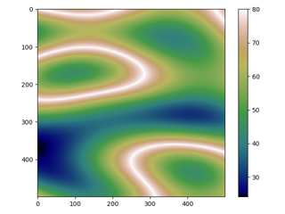
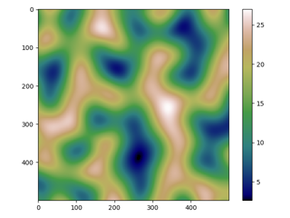
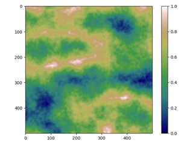
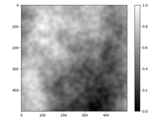
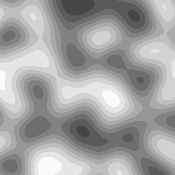
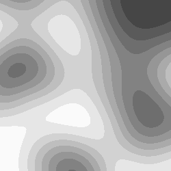
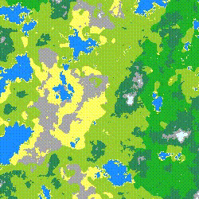

# Tile Maps

## Table of contents
1. [ How does it work ](#howto)
2. [ Dependencies ](#deps)
3. [ Usage ](#usage)
4. [ Parameters ](#params)
    1. [ seed ](#seed)
    2. [ config path ](#cfgpth)
    3. [ resolution ](#res)
    4. [ grid ](#grid)
    5. [ output path ](#outpth)
5. [ World generator config ](#worldcfg)
    1. [ Parameters ](#worldcfg-params)
    2. [ Example](#worldcfg-example)
6. [ Examples ](#examples)


## How does it work <a name="howto"></a>
Tile-map is a program for generating tile maps written in python.
It uses simplex noise to generate noise maps. 
In order to create complex, realistic height maps, 
the program combines various many simplex noise maps with different settings as octave, noise or exponent.
The same principle rules creating moisture maps.
After combining both moisture and height maps, the program creates biome map, assigns them the appropriate colors 
defined in the configuration and generates output picture.

The world configuration is stored as a dict.
The SimplexNoise class is used to create noise maps. 
It uses the OpenSimplex library. Two-dimensional
noise function has the form: 

_**value=noise_function(x,y)**_

OpenSimplex library provides such a function.
The simplex_noise module uses it to generate noise maps (stored as numpy 2d arrays of floats).

The terrain module takes care of generating world's terrain as specified in the configuration.
 

### Example
Examples of a ridge (left) and simplex (right) variants of the noise maps:




After combining them and many other layers of noise maps, we get something like this:



On the same principles, terrain class generates moisture map:



After assigning proper height and moisture values their biome, 
the program assigns biome to the specific color of that biome as specified in configuration, and generates an output image:


## Dependencies <a name="deps"></a>


Use the package manager [pip](https://pip.pypa.io/en/stable/) to install dependencies.

```bash
pip install -r requirements.txt
```

## Usage <a name="usage"></a>

```bash
python3 gen_tile_map.py <arguments>
```

## Parameters <a name="params"></a>

All available input parameters are described below.
No arguments are required.

### seed <a name="seed"></a>
World seed of positive integer type.

Default: 0

Example:

```bash
python gen_tile_map.py --seed 123
```

### config path <a name="cfgpth"></a>
World generator configuration path (string, file must be of json type).

Default: 'default_world_config.json'

Example:

```bash
python gen_tile_map.py --config_path 'my_world_config.json'
```

### resolution <a name="res"></a>
Define the shape of the tile map (tuple of positive integers).

Default value should be in world_config json (world generator is dependent on shape),
if it is not found there, the default value is (256,256)

Example:

```bash
python gen_tile_map.py --resolution 512 512
```

### grid <a name="grid"></a>
Tell the program whether you want to add grid to the output image.

Default: False

Example:

```bash
python gen_tile_map.py --grid
python gen_tile_map.py --no_grid
```

### output path <a name="outpth"></a>
Tile map image output path (string, file must be of png type).

Default: 'output.png'

Example:

```bash
python gen_tile_map.py --output_path 'my_output.png'
```

## World generator config <a name="worldcfg"></a>
The world generator config is stored in the dict loaded from a json file passed as an argument to the program. 
(see config path program parameter)

All available world config parameters are described below:

### Parameters <a name="worldcfg-params"></a>

#### shape
Define the shape of the tile map (tuple of positive integers).

Default: (256, 256)

Example:
```json
"shape": [250, 250]
```

#### normalization range
Define the range to which output map values are scaled (tuple of floats).

Its useful when you want to define more complex biome thresholds.
If you set normalization range to bigger values, you could avoid using floats.

Default: (0, 1)


Example:
```json
"normalization_range": [0, 1000]
```

#### height map/moisture map


Example:
```json
"normalization_range": [0, 1000]
```


### Example config <a name="worldcfg-example"></a>
simple config with 3 biomes
```json
{
  "shape": [250, 250],
  "normalization_range": [0.0, 1.0],
  "height_map": [
    {
      "noise_variant": "simplex",
      "octaves": [
        [5, 5],
        [10, 10]
      ],
      "elevation_distribution": [2, 1],
      "noise_exp": 1
    },
    {
      "noise_variant": "ridge",
      "octaves": [
        [2, 2]
      ],
      "elevation_distribution": [3]
    }
  ],
  "moisture_map": [
    {
      "octaves": [
        [30, 30]
      ],
      "elevation_distribution": [1]
    }
  ],
  "biomes":
  {
    "WATER": [30, 144, 255],
    "DESERT": [255, 255, 102],
    "GRASSLAND": [154, 205, 50]
  },
  "biome_thresholds":
  [
    [0.3, [[1.0, "WATER"]]],
    [0.4, [[1.0, "DESERT"]]],
    [0.59, [[0.4, "DESERT"], [1.0, "GRASSLAND"]]],
    [0.80, [[0.7, "DESERT"], [1.0, "GRASSLAND"]]],
    [1.0, [[1, "DESERT"]]]
  ]
}
```
## Examples <a name="examples"></a>
### Default world config
Example of a world of shape [500, 500] generated with the default config.


### Octaves
On the left side there is a tile map made with height_map_simplex config. 
Biome mapping in that config lacks moisture data. Only height map is visible on the pictures. 
There are 5 octaves in both dimensions.




###

For comparision there are 2.5 octaves in both dimensions on the next picture.
Its made with the same seed and config as the first picture.
If you look closely, you can notice that it is in fact differently normalized and scaled 
upper left section of the first picture.



### Height exponent



### Moisture exponent


